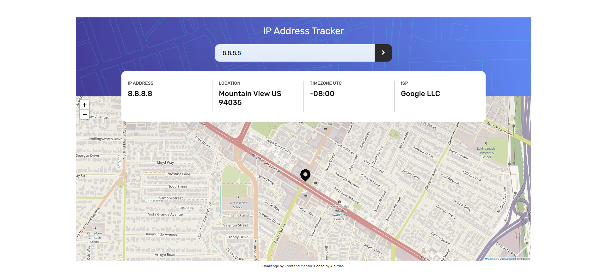
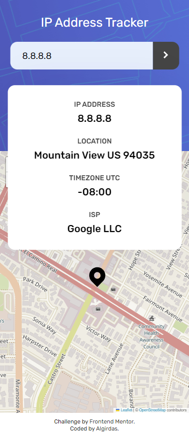

# Frontend Mentor - IP address tracker solution

This is a solution to the [IP address tracker challenge on Frontend Mentor](https://www.frontendmentor.io/challenges/ip-address-tracker-I8-0yYAH0). Frontend Mentor challenges help you improve your coding skills by building realistic projects. 

## Table of contents

- [Overview](#overview)
  - [The challenge](#the-challenge)
  - [Screenshot](#screenshot)
  - [Links](#links)
- [My process](#my-process)
  - [Built with](#built-with)
  - [What I learned](#what-i-learned)
  - [Continued development](#continued-development)
 - [Author](#author)
- [Acknowledgments](#acknowledgments)

## Overview

### The challenge

Users should be able to:

- View the optimal layout for each page depending on their device's screen size
- See hover states for all interactive elements on the page
- See their own IP address on the map on the initial page load
- Search for any IP addresses and see the key information and location

### Screenshot


 

### Links

- Solution URL: (https://github.com/AlgirdasU/IP-address-tracker-master)
- Live Site URL: (https://heroic-pegasus-9a26ac.netlify.app)

## My process

### Built with

- Semantic HTML5 markup
- CSS custom properties
- Flexbox
- CSS Grid
- BEM
- JS

### What I learned

How to search any IP addresses and render key information and location. I've learned how to update the map after each new search.

To see how you can add code snippets, see below:

```html
```
```css
```
```js
const map = L.map("map");
L.tileLayer("https://{s}.tile.openstreetmap.fr/hot/{z}/{x}/{y}.png", {
  attribution:
    '&copy; <a href="https://www.openstreetmap.org/copyright">OpenStreetMap</a> contributors',
}).addTo(map);

const myIcon = L.icon({
  iconUrl: "./images/icon-location.svg",
  iconSize: [32, 40],
  iconAnchor: [10, 30],
});

let markerIcon;
const updateCoords = (coords) => {
  map.setView(coords, 16);
  if (markerIcon != null && markerIcon != undefined) markerIcon.remove();
  markerIcon = L.marker(coords, { icon: myIcon });
  markerIcon.addTo(map);
};
```

## Author

- Website - [Algirdas](https://github.com/AlgirdasU/IP-address-tracker-master)
- Frontend Mentor - [@Algirdase](https://www.frontendmentor.io/profile/AlgirdasU)
- Twitter - [@AlgirdasDdd](https://twitter.com/algirdasddd)

